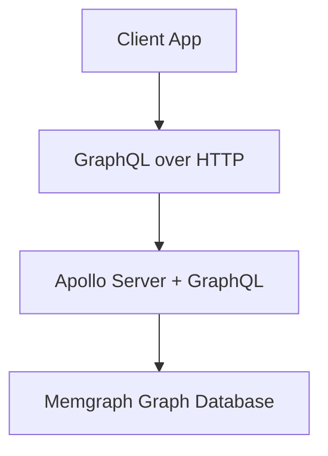

# CCDI DCC GraphQL API Documentation

Welcome to the official documentation site for the **CCDI DCC GraphQL API**. This site covers project overview, setup, usage patterns, example queries, real-world use cases, and integration with AI assistants through the **Model Context Protocol (MCP)**.

The CCDI DCC GraphQL API provides a unified interface to access richly connected biomedical research data.


## When to Use this API
Use this service when you need:
- Flexible graph traversal across biomedical entities
- Rapid prototyping with a self-describing schema
- Programmatic + AI-assisted exploration of study data
- Consistent aggregation and metadata querying


## High-Level Architecture



## Example Simple Query
```graphql
query Participants {
  participants(options: { limit: 5 }) {
    participant_id
    race
    sex_at_birth
  }
}
```

## Claude Integration 
The API is exposed via an MCP tool that you can access the data through AI Client like Claude.  

See: [MCP Overview](client-integration-claude.md).

---
© CCDI DCC Project
