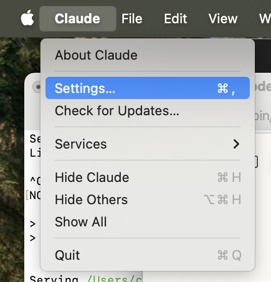

# Claude Integration with mcp-graphql

Use the open‑source [`mcp-graphql`](https://github.com/blurrah/mcp-graphql) MCP server so Claude can discover the schema and run read queries against this API. It exposes two tools:
1. `introspect-schema` – returns (or loads) the GraphQL schema
2. `query-graphql` – executes a GraphQL operation (mutations disabled unless explicitly allowed)

---
## 1. Install / Register
### Option A – Smithery (fastest for Claude Desktop)
```bash
npx -y @smithery/cli install mcp-graphql --client claude
```

### Option B – Manual config (Claude Desktop)
Locate your config file:

 macOS/Linux:  `~/Library/Application Support/Claude/claude_desktop_config.json` 

 Windows:  `%APPDATA%/Claude/claude_desktop_config.json` 


Add (or merge) the MCP server entry, then restart Claude:
```json
{
  "mcpServers": {
    "ccdi-graphql": {
      "command": "npx",
      "args": ["mcp-graphql"],
      "env": {
        "ENDPOINT": "http://localhost:9000/graphql",
        "ALLOW_MUTATIONS": "false"
      }
    }
  }
}
```


---
## 2. Verify
1. Restart Claude Desktop.
2. Open the tool picker (+). Confirm `ccdi-graphql` is listed (see screenshot).  
   
3. Open Settings → Developer Panel → MCP. Confirm status is “connected.”  
   
4. In the MCP status list you should see active traffic after first request.  
   

If not visible: check endpoint URL, server running state, or firewall/proxy.

---
## 3. What to Ask Claude
| Goal | Example Prompt |
|------|----------------|
| List types | "List available GraphQL types" |
| Describe a type | "Describe the sample type" |
| Starter query | "Give me a starter query for participants with samples" |
| Refine | "Add sequencing file names to that query" |
| Run query | "Run this" (paste modified query) |

Tips:
* Start with small `limit`s
* Add one nested relationship at a time
* Ask for refinement instead of rewriting by hand

---
## 4. Example Dialogue
You: List available GraphQL types  
Claude: (runs `introspect-schema`)  
You: Describe participant  
Claude: (returns field list)  
You: Give me a starter query for first 5 participants with samples  
Claude: (template)  
You: Run this (paste query)  
Claude: (data result)  

---